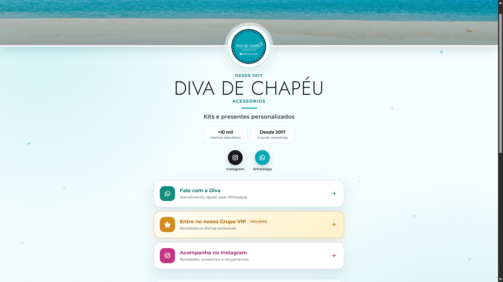

# DIVA DE CHAPÉU — Link da Bio

Página de links da **Diva de Chapéu**, criada para reunir os principais canais da marca em uma experiência leve, elegante e responsiva.

## Sobre o projeto

A página apresenta a marca, seus canais de atendimento e avaliações de clientes. O visual foi inspirado em praia, areia e céu azul, utilizando a identidade turquesa da Diva de Chapéu.

## Prévia do site



## Funcionalidades

- Acesso rápido ao Instagram e WhatsApp
- Grupo VIP em destaque
- Carrossel animado com avaliações de clientes
- Link para feedbacks publicados no Instagram
- Botão nativo de compartilhamento
- Imagem personalizada ao compartilhar o link
- Animações suaves e fundo em gradiente
- Layout responsivo para celular, tablet e computador
- Imagens otimizadas em WebP

## Tecnologias

- HTML5
- CSS3
- JavaScript
- Font Awesome
- Google Fonts

## Estrutura

```text
diva-linkbio/
├── assets/
│   ├── capa-praia.webp
│   ├── image.png
│   ├── logo-diva.webp
│   └── og-diva.jpg
├── index.html
├── script.js
├── style.css
└── README.md
```

## Como abrir localmente

1. Baixe ou clone este repositório.
2. Abra a pasta no VS Code.
3. Abra o arquivo `index.html` no navegador ou utilize a extensão **Live Server**.

## Créditos

Desenvolvido por [pedrocha.dev](https://www.instagram.com/pedrocha.dev/).
